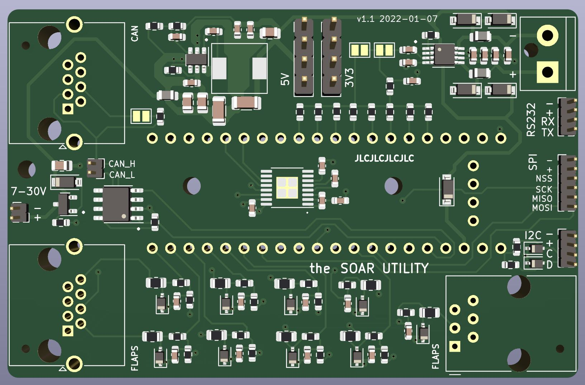
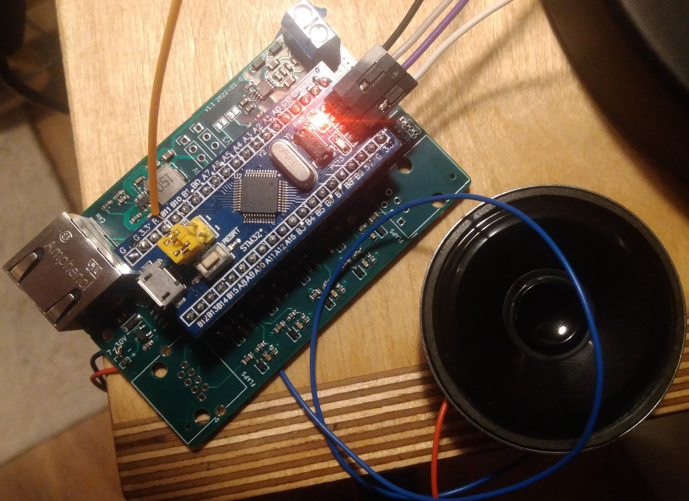

# PCB design for utility module
Utility hardware design for Audio Module, Analog Inputs, I2C/SPI sensors, RS232 and some digitial inputs. 
- PCB assembly files are below pcb/assembly/
- PDF Schematic is below pcb/pdf_exports/ 

## Components
- STM32F103 Bluepill board.
- 9 to 30V DC DC power supply.
- PAM8302AAS  audio amplifier connected to STM32F1 PWM output
- Screwterminal for loudspeaker
- RJ45 connector for sensing e.g. gear, flaps, airbrakes postion
- RJ45 connector for CAN Interface and CAN transceiver
- RJ12 connector with analog and digital inputs
- 1.27mm pitch header for external I2C devices
- 1.27mm pitch header for RS232 and SPI interface

## Pictures

## Improvements for next version
- External connectors for voltage / I2C / RS232 are tiny.  Increase size to e.g. 2.54mm pitch or chose a different connector.
- Make external i2c sensor voltage switchable to be able to perform a hard sensor reset. 
- Replace C32 47uF with a sufficient voltage rating. The used one is only specified for up to 10V!